# 🎬 Klipzy Studio

A **local-first Long Form to Shorts studio by TechFreq Developments** for Windows, macOS, and Linux. Turn long videos, podcasts, and streams into ready-to-post vertical Shorts — entirely on your own machine. **No cloud AI, no fees.**

> ⚖️ Licensed under the **TechFreq Developments Open-Attribution License** (see [LICENSE.md](LICENSE.md)). Free to use and modify, provided you credit TechFreq Developments as the original author.

---

## 📸 Screenshots

<table>
  <tr>
    <td width="50%">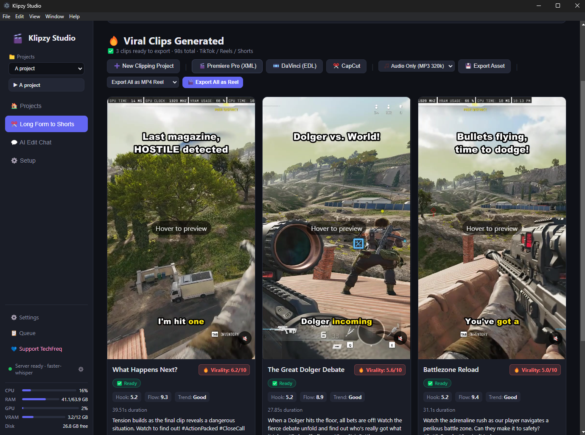<br/><sub><b>Viral clips generated</b> — AI-scored, auto-captioned, each with its own hook, title & description.</sub></td>
    <td width="50%">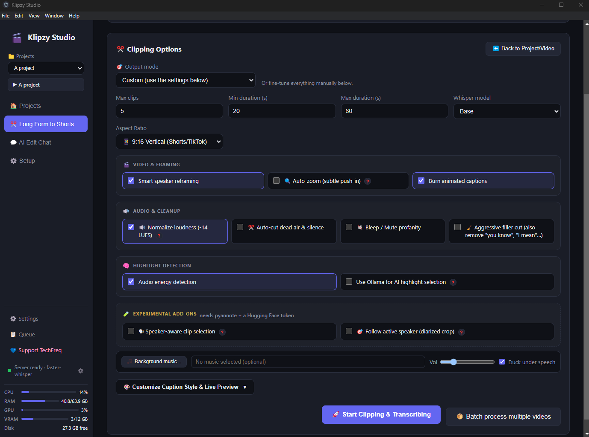<br/><sub><b>Clipping &amp; style</b> — durations, aspect ratio, smart framing, audio cleanup, highlight detection.</sub></td>
  </tr>
  <tr>
    <td width="50%">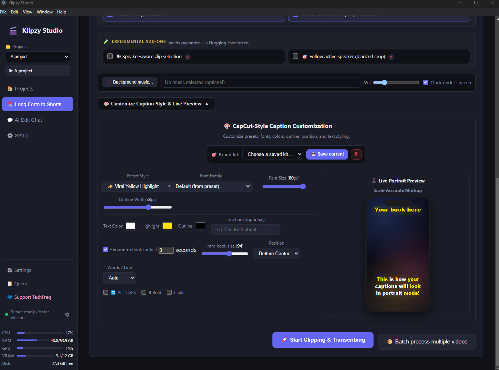<br/><sub><b>Caption customization</b> — CapCut-style presets, colors & fonts with a live portrait preview.</sub></td>
    <td width="50%">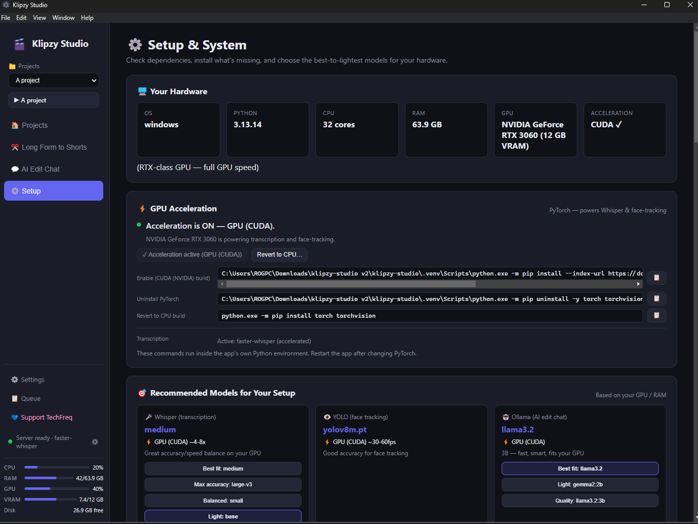<br/><sub><b>Setup &amp; System</b> — hardware detection, GPU (CUDA) acceleration & hardware-matched models.</sub></td>
  </tr>
  <tr>
    <td width="50%">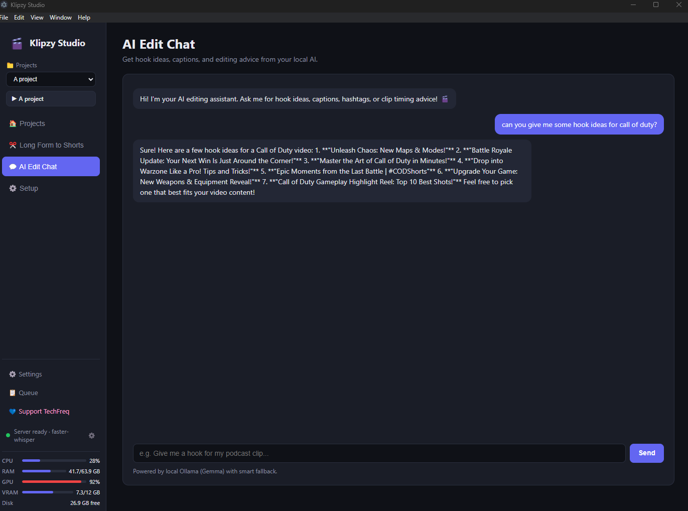<br/><sub><b>AI Edit Chat</b> — hook ideas, captions & editing advice from your local model (Ollama).</sub></td>
    <td width="50%">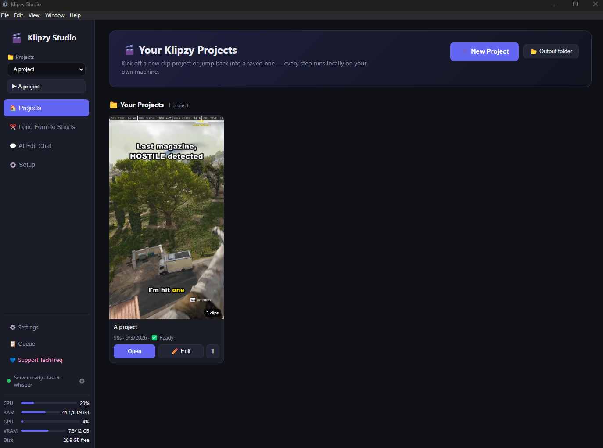<br/><sub><b>Projects</b> — your saved clip projects; every step runs locally on your own machine.</sub></td>
  </tr>
</table>

<details>
<summary><b>More screenshots</b> — workflow, processing, per-clip tools, model catalog &amp; setup</summary>

<br/>

<table>
  <tr>
    <td width="50%">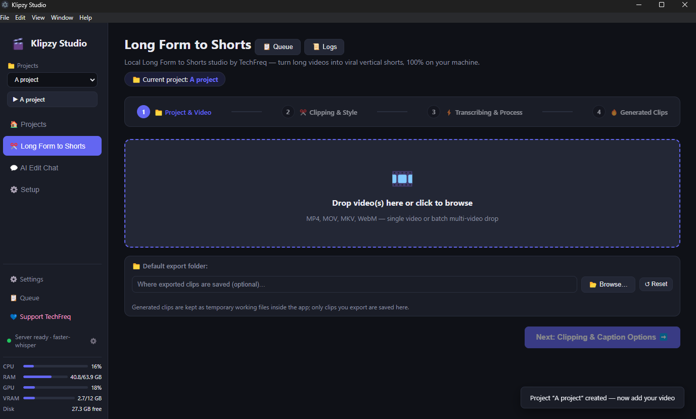<br/><sub><b>1. Drop a video</b> — the guided 4-step flow: Project → Clipping &amp; Style → Transcribe → Clips.</sub></td>
    <td width="50%">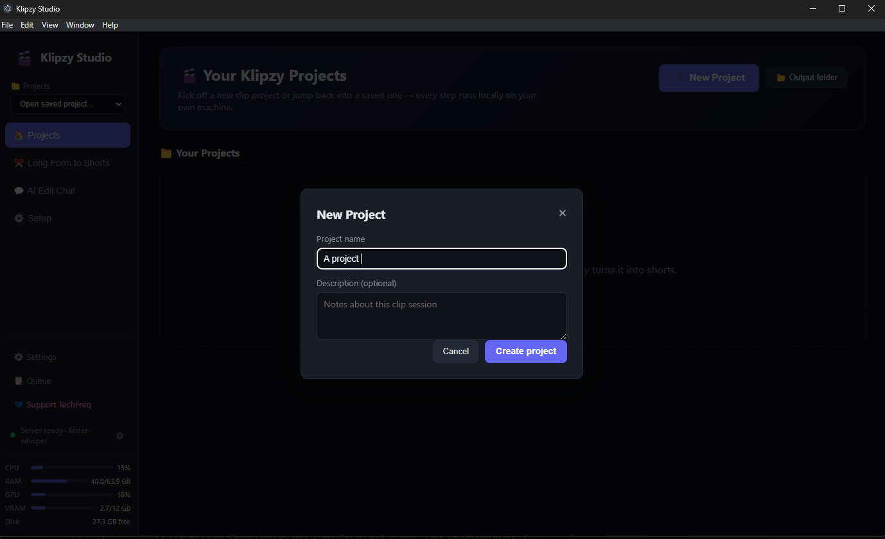<br/><sub><b>New project</b> — name it and go; projects are saved locally.</sub></td>
  </tr>
  <tr>
    <td width="50%">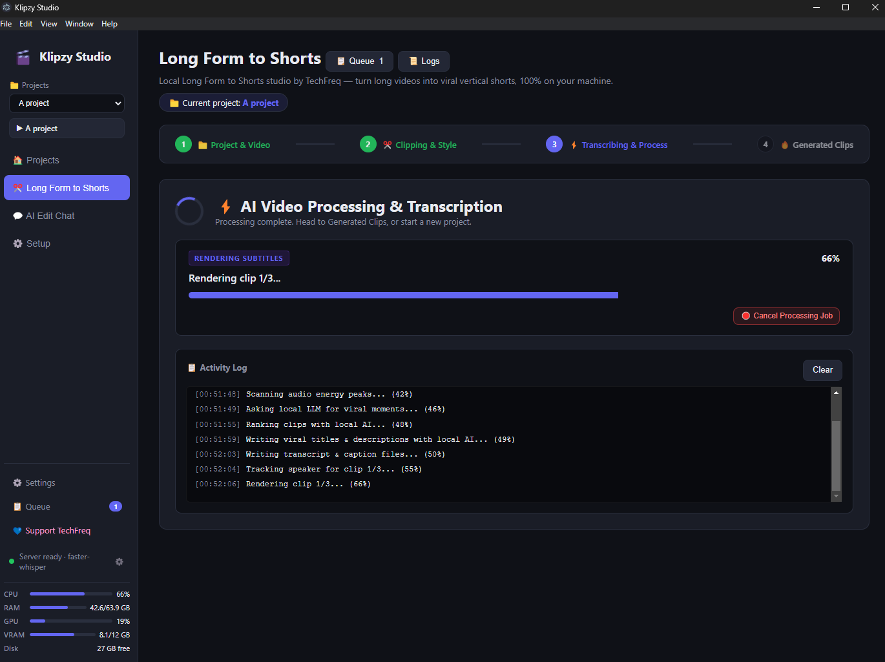<br/><sub><b>Processing</b> — live log: audio energy, local-LLM ranking, viral titles/descriptions, rendering.</sub></td>
    <td width="50%">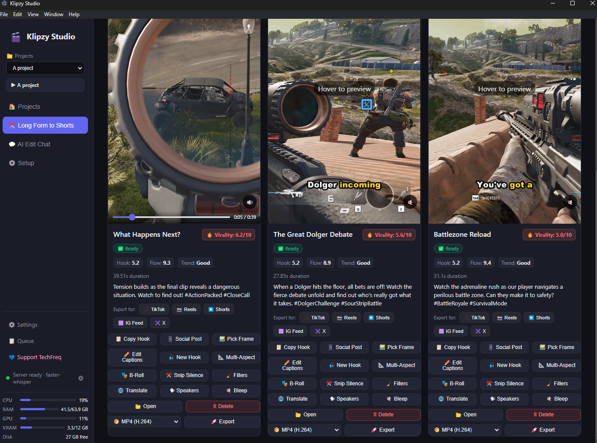<br/><sub><b>Per-clip tools</b> — new hook, edit captions, multi-aspect, B-roll, silence/filler cuts, translate, bleep, export.</sub></td>
  </tr>
  <tr>
    <td width="50%">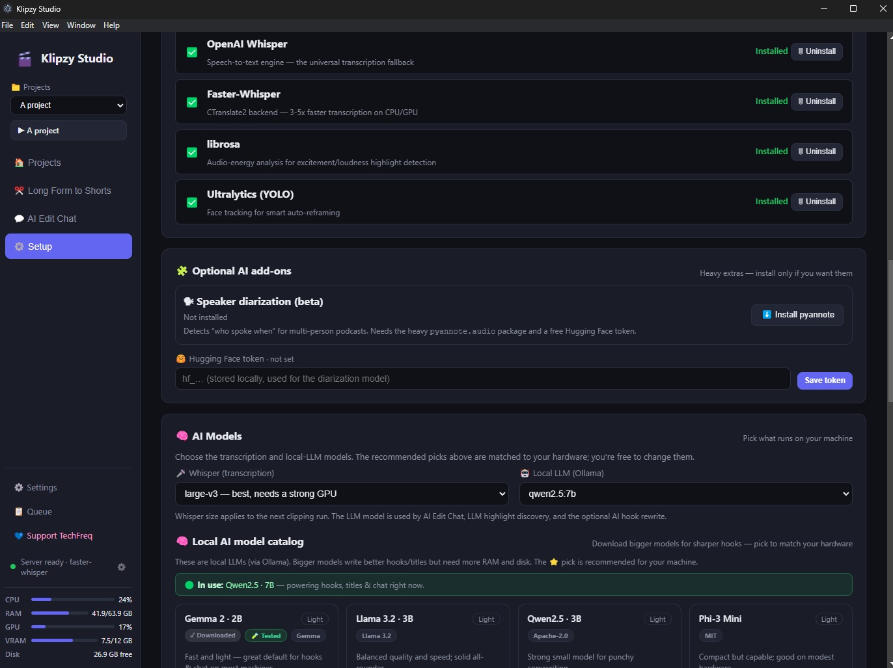<br/><sub><b>Local AI model catalog</b> — pick/download local LLMs matched to your hardware.</sub></td>
    <td width="50%">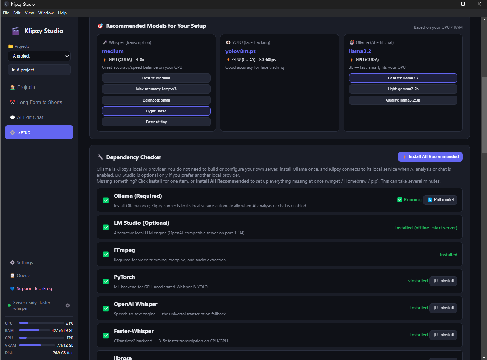<br/><sub><b>Dependency checker</b> — one-click install of Ollama, FFmpeg, PyTorch, Whisper &amp; more.</sub></td>
  </tr>
  <tr>
    <td width="50%">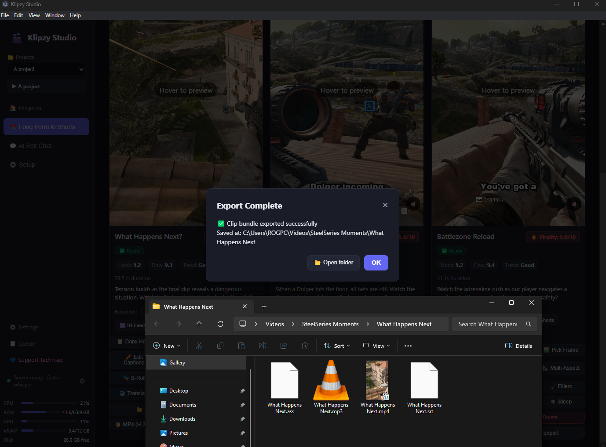<br/><sub><b>Export</b> — clip + audio (MP3) + subtitles (SRT/ASS) exported together.</sub></td>
    <td width="50%"></td>
  </tr>
</table>

</details>

---

## ✨ Features

| Feature | Description |
|---------|-------------|
| 🎯 **AI Virality & Hook Detection** | Finds the most engaging moments with virality scores, hook strength, and trend breakdowns |
| ⚡ **Hardware Acceleration** | Auto GPU video encoding (NVIDIA NVENC, Apple Silicon VideoToolbox, x264 CPU fallback) |
| 🎨 **Viral Dynamic Captions** | 22 word-by-word karaoke caption presets (`.ass`) with dynamic color styling |
| ✏️ **Interactive Caption Editor** | Live word-timestamp adjusting and subtitle customization |
| 🎬 **NLE Project Exports** | Export timelines to **Adobe Premiere Pro** (XML), **DaVinci Resolve** (EDL), or **CapCut** (Draft) |
| 🔊 **Audio Energy Detection** | Detects excitement spikes and loudness peaks to catch dramatic moments |
| ✂️ **Silence / Dead-Air Cutter** | FFmpeg `silencedetect` jump-cuts to keep energy high |
| 🔇 **Profanity Filter** | Word-level bleep / mute / caption masking |
| 🎮 **Gaming / Reaction Layout** | Full gameplay + scalable webcam PiP in any corner |
| 🤖 **Optional LLM Discovery** | Uses local Ollama (Gemma) to pick viral moments from the transcript |
| 🗣️ **Speaker-Aware Face Tracking** | Tracks the active speaker so 9:16 crops stay centered |
| 💬 **AI Edit Chat** | Chat with local AI for hook ideas, captions, hashtags, and edits |
| 📦 **100% Local & Private** | Whisper, YOLO, Ollama, FFmpeg all run on your machine — no cloud |

---

## 🏗️ Architecture

```
┌─────────────────────────────────────────────────┐
│  Electron Desktop App (UI)                        │
│  - Windows / macOS / Linux                        │
│  - Drag & drop, options, progress, previews       │
└────────────────────┬──────────────────────────────┘
                     │ localhost HTTP (token-authenticated)
┌────────────────────▼──────────────────────────────┐
│  Python FastAPI Server                            │
│  - Job queue & progress polling                   │
│  - AI Edit Chat                                   │
└────────────────────┬──────────────────────────────┘
                     │
┌────────────────────▼──────────────────────────────┐
│  Processing Pipeline                              │
│  FFmpeg → Whisper → Highlights → Face Track →     │
│  Render 9:16 + captions                           │
└─────────────────────────────────────────────────┘
```

---

## 🚀 Quick Start

### Prerequisites

1. **Python 3.10+**
2. **FFmpeg** (with `ffprobe` and `libass`)
   - Windows: `winget install Gyan.FFmpeg`
   - macOS: `brew install ffmpeg`
   - Linux: `sudo apt install ffmpeg libass-dev`
3. **Node.js 18+** (for the Electron desktop UI — the server also runs standalone)

### Option A — one-click launchers (recommended)

- **Windows:** double-click `start_klipzy.bat`, or run `scripts\run_windows.bat`
- **macOS / Linux:** run `./scripts/run_macos.sh`

These set up the Python virtual environment and UI dependencies on first run, then launch the desktop app (which starts the backend for you).

### Option B — manual

**1. Python server (core engine)**

```bash
python -m venv .venv

# Windows
.\.venv\Scripts\activate
# macOS / Linux
source .venv/bin/activate

pip install -r requirements.txt

# Start the API server
python scripts/main.py
```

Then open <http://127.0.0.1:8765/docs> for the interactive API docs.

**2. Electron desktop app**

```bash
cd ui
npm install
npm start
```

---

## 🔒 Local API Security

The backend listens on `127.0.0.1` but is **token-authenticated**: the desktop app
generates a per-launch secret and sends it in the `X-Klipzy-Token` header. This
prevents other web pages in your browser from reaching the local API (which can
launch installers and touch the filesystem).

- `/health` and the `/docs` pages are the only unauthenticated routes.
- For scripted / headless use, the token is written to `logs/api_token.txt`.
- Set `KLIPZY_DISABLE_AUTH=1` to turn enforcement off (test suite / at your own risk).

---

## 🧠 AI Components

| Component | Tool | License | Purpose |
|-----------|------|---------|---------|
| Transcription | OpenAI **Whisper** | MIT | Speech → text with word timestamps |
| Face tracking | **YOLOv8** (ultralytics) | AGPL-3.0 | Speaker-aware 9:16 crop |
| Local LLM | **Ollama** + Gemma | MIT | AI edit chat + highlight discovery |
| Video processing | **FFmpeg** | LGPL/GPL | Extract, cut, crop, burn captions |

> **Note on YOLO/ultralytics:** Ultralytics is AGPL-3.0. Using it as a dependency is fine; if you distribute a modified version of *their* library you must share it. For permissive licensing, swap in OpenCV's `cv2.CascadeClassifier` or MediaPipe (Apache-2.0).

---

## 🔌 AI engine — bring your own (optional)

One app, one setting. **Ollama is built in and used by default**, so there's nothing to
configure if you just want it to work. But every AI feature (highlight discovery, hook/title
copywriting, AI Edit Chat, caption translation) can be pointed at **any OpenAI-compatible
server** instead — they all speak the same `/v1/chat/completions` contract, so a single
"server address + model name" is all Klipzy needs:

| Server | Typical address |
|---|---|
| **LM Studio** | `http://localhost:1234/v1` |
| **llama.cpp** (`llama-server`) | `http://localhost:8080/v1` |
| **vLLM** | `http://localhost:8000/v1` |
| **Ollama's OpenAI route** | `http://localhost:11434/v1` |
| Cloud endpoint | provider's base URL + an API key |

Set it in **Setup → AI engine**: pick *Custom (OpenAI-compatible)*, paste the address, and hit
**Test connection** before saving. Reasoning models that reply via `reasoning_content` are
handled too.

> **Still local-first.** Nothing leaves your machine unless *you* deliberately enter a cloud
> address. Every AI feature also degrades to offline heuristics when no engine is reachable, so
> the app never hard-fails because a model is down.

---

## 🧪 Tests

```bash
pytest tests/ -v
```

Covers highlight detection, subtitle generation, NLE exports, aspect-ratio
reframing, silence detection, profanity filtering, logging, the API token guard,
and the transcription-backend reporter.

**Verified end-to-end:** a real ~24-min 1080p HEVC video runs through the full
pipeline and produces genuine 1080×1920 (9:16) H.264 clips with burned-in captions
and thumbnails. On CPU with `faster-whisper`, a 2-minute source yields finished
clips in well under a minute; expect longer for full-length sources and much
faster with a CUDA GPU or Apple Silicon (MLX).

> **GPU note:** having an NVIDIA card isn't enough on its own — the ML stack needs
> the CUDA build of PyTorch. If the Setup panel shows **"CPU (GPU idle)"**, install
> the CUDA PyTorch build (Setup → Install, or `pip install torch torchvision
> --index-url https://download.pytorch.org/whl/cu126`) to unlock GPU speed. The app
> runs correctly on CPU either way — it just picks the fastest backend it can
> actually use and falls back safely if an accelerator isn't usable.

---

## 📦 Packaging

Build desktop installers from `ui/` with electron-builder:

```bash
cd ui
npm run dist:win     # Windows (NSIS installer + portable)
npm run dist:mac     # macOS (DMG)
npm run dist:linux   # Linux (AppImage)
```

Output lands in `ui/dist/`. The packaged app currently expects **Python 3.10+** on
the target machine — the Python runtime isn't bundled yet, so a fully
self-contained build (via PyInstaller) is planned.

---

## 🗺️ Roadmap

**Done**
- [x] Local transcription + word timestamps
- [x] Heuristic + audio-energy highlight detection
- [x] Speaker-aware 9:16 smart crop
- [x] Caption export (SRT/VTT/ASS) + burn-in
- [x] Interactive caption editor
- [x] Manual clip trimmer UI
- [x] Gaming / reaction layouts
- [x] AI edit chat (Ollama + fallback, Ollama optional)
- [x] NLE exports (Premiere / DaVinci / CapCut)
- [x] Silence cutter + profanity filter
- [x] Electron desktop app (Win/macOS/Linux)
- [x] Token-authenticated local API
- [x] **Cross-platform hardware acceleration** — NVENC (NVIDIA), VideoToolbox
  (Apple Silicon **and** Intel Mac), Intel QSV, AMD AMF, Linux VAAPI, x264 fallback
- [x] **MLX-accelerated transcription on Apple Silicon** — `mlx-whisper` is the
  preferred backend on M-series, auto-selected at runtime, with `faster-whisper`
  (CTranslate2) elsewhere and `openai-whisper` as the universal fallback
- [x] **Hardware-aware model recommendation** — the Setup panel detects your
  GPU / VRAM / RAM / chip and *recommends* the best Whisper / YOLO / Ollama model
  (you choose and install it — nothing is downloaded behind your back)
- [x] **Live backend readout** — the header shows the active transcription engine;
  click the status to jump into Setup & diagnostics

**Coming soon**
- [ ] URL / stream import — YouTube, Twitch, Kick (`yt-dlp`)
- [ ] One-click install of the recommended model straight from the Setup card
- [ ] MLX beyond transcription (highlight/LLM stages on Apple Silicon)
- [ ] Multi-speaker split-screen
- [ ] Multilingual subtitles / dubbing
- [ ] Auto-posting to TikTok / YouTube / Reels

---

## 📄 License

Licensed under the **TechFreq Developments Open-Attribution License**. Free to use
and modify, provided credit is given to **TechFreq Developments** as the original
author. See [LICENSE.md](LICENSE.md) for full details.

**Third-party notices:** Whisper (MIT), FFmpeg (LGPL/GPL), Ollama (MIT), ultralytics (AGPL-3.0).
